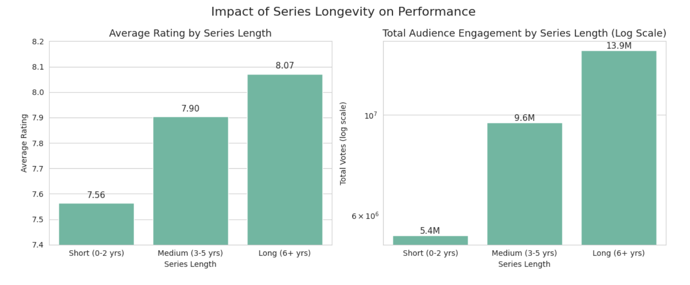

## Project Overview

Streaming platforms generate enormous amounts of data every day. Ratings, genres, runtime, audience engagement, release dates, and other metadata together provide valuable insights into viewer preferences and content performance.

This project walks through the complete process of analyzing an IMDb dataset containing the **Top 10,000 Netflix Movies & TV Shows**, focusing on data preparation before extracting meaningful insights.

Rather than building a machine learning model, this notebook emphasizes one of the most important skills in data science:

## Dataset

**Dataset Source**

IMDb Netflix Movies & TV Shows Dataset

https://www.kaggle.com/datasets/bharatnatrayn/movies-dataset-for-feature-extracion-prediction

The dataset contains information such as:

- Movie / Series title
- Release year
- Genre
- IMDb Rating
- Votes
- Runtime
- Gross Revenue
- Cast
- Directors
- Short description


# Objectives

The primary goals of this project are to:

- Understand the business problem before analysis
- Inspect and evaluate data quality
- Clean inconsistent real-world data
- Engineer useful analytical features
- Explore trends using visualizations
- Draw meaningful conclusions from the data


# Project Workflow

The notebook follows a structured data analysis pipeline.

```
Problem Definition
        │
        ▼
Data Inspection
        │
        ▼
Data Cleaning
        │
        ▼
Feature Engineering
        │
        ▼
Exploratory Data Analysis
        │
        ▼
Insights & Conclusions
```

# Data Cleaning

The notebook demonstrates several common real-world cleaning tasks.

### Duplicate Removal

- Identified duplicated observations
- Removed duplicate rows


### String Cleaning

Cleaned inconsistent formatting such as

- newline characters
- extra whitespaces
- malformed strings

Affected columns:

- Genre
- Stars
- Description

### Year Standardization

The original dataset contained multiple year formats such as

```
(2021)

(2010–2022)

(2019– )

```

These were transformed into structured features:

- Start_Year
- End_Year
- Is_Series
- Is_Ongoing

This makes temporal analysis significantly easier.

### Feature Engineering

Several new analytical features were created.

Examples include:

- Director
- Stars_List
- Star_Count
- Start_Year
- End_Year
- Is_Series
- Is_Ongoing

The Genre column was also transformed into a list and exploded for genre-level analysis.


### Missing Value Handling

Different strategies were applied depending on the type of missing data.

Examples:

- Missing ratings removed
- Runtime imputed separately for Movies and Series
- Missing genres labelled as "Unknown"
- Gross revenue removed because of excessive missingness


### Outlier Analysis

Instead of blindly removing outliers, observations were evaluated for business relevance before deciding whether they should be retained.

# Exploratory Data Analysis

The notebook investigates multiple questions including:

## Dataset Composition

- Movies vs Series distribution


## Runtime Analysis

- Average runtime
- Movies vs Series


## Rating Analysis

- Distribution of IMDb ratings
- Movies vs Series comparison


## Series Analysis

- Ongoing vs Completed
- Series longevity

## Genre Analysis

Top genres by

- Popularity
- Ratings
- Audience engagement

Bottom-performing genres

## Correlation Analysis

Relationship between

- Rating vs Votes
- Runtime vs Rating


## Time-Based Analysis

- Ratings by decade
- Number of titles released over time

# Key Insights

Some findings from the analysis include:

- TV Series receive noticeably higher average IMDb ratings than Movies.
- Movies attract significantly more audience votes than Series.
- Drama is the most popular genre in terms of audience engagement.
- Animation has the highest average rating among major genres.
- Most IMDb ratings fall between **6.5–8.0**.
- Runtime has a weak negative correlation with ratings.
- Ongoing series considerably outnumber completed ones in the dataset.
- Long-running series generally receive both higher engagement and stronger ratings.


# Technologies Used

- Python
- Pandas
- NumPy
- Matplotlib
- Seaborn
- Scikit-Learn (supporting utilities)


# Repository Structure

```
├── notebook.ipynb
├── README.md
├── images/
│   ├── rating_distribution.png
│   ├── genres.png
│   ├── runtime.png
│   ├── popularity.png
│   └── ...
└── requirements.txt
```


# Skills Demonstrated

This project demonstrates practical skills in

- Data Cleaning
- Exploratory Data Analysis (EDA)
- Data Wrangling
- Feature Engineering
- Missing Value Treatment
- Outlier Analysis
- Statistical Interpretation
- Data Visualization
- Business-Oriented Insight Generation
- Python Data Analysis Stack

- 
  
